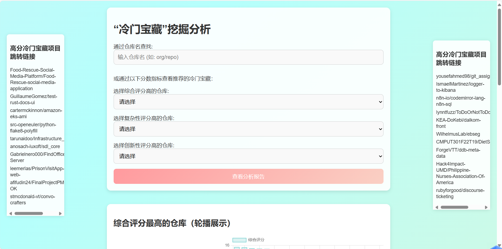
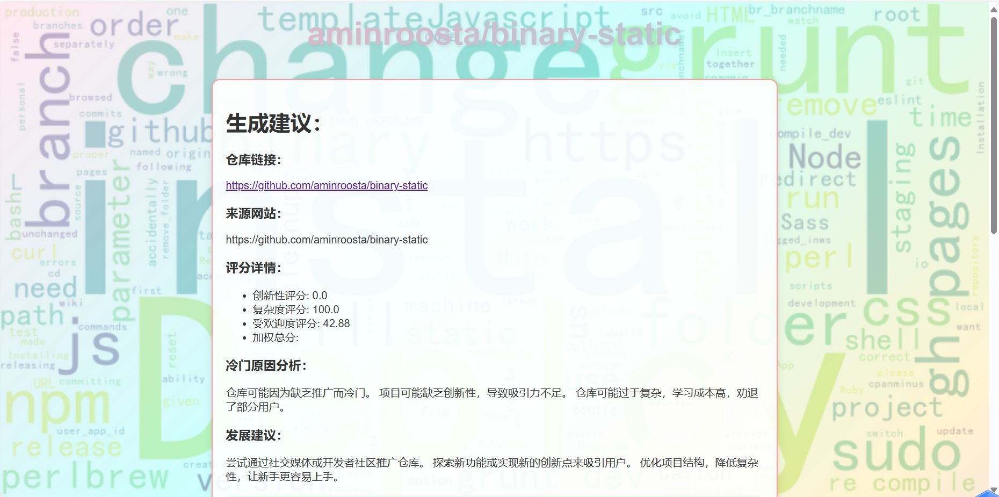
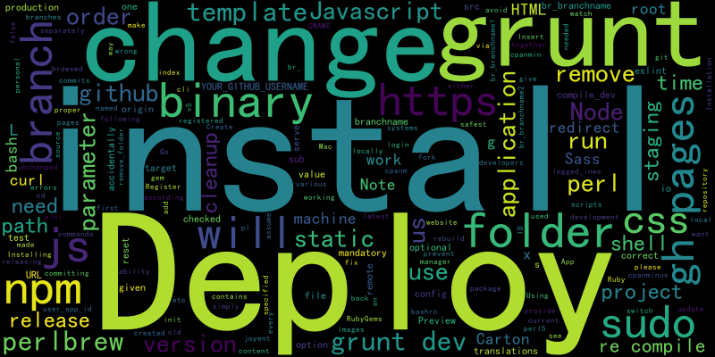
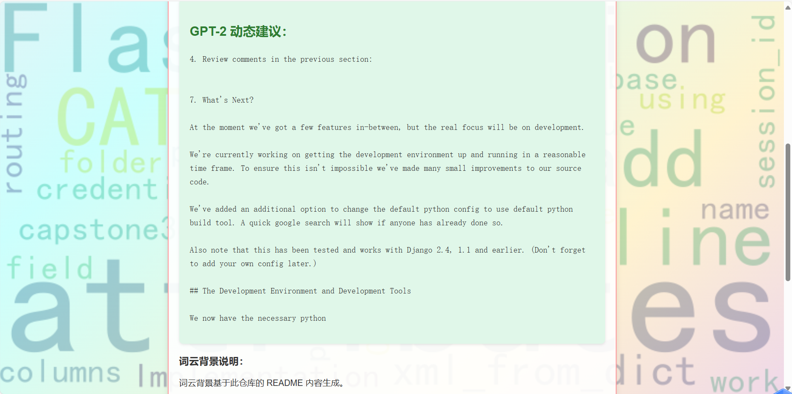

# 开源生态系统中的“冷门宝藏”挖掘

  

“酒香也怕巷子深”。

通过对开源项目的多维数据分析，挖掘那些**质量高**、**创新性强**但**关注度较低**的“冷门宝藏”项目，分析其受限原因，并提出提升曝光度的建议。

## 目录
- [:hand_with_index_finger_and_thumb_crossed: 项目成员](#hand_with_index_finger_and_thumb_crossed-项目成员)
- [:movie_camera: 部分界面展示](#movie_camera-部分界面展示)
- [:open_file_folder: 项目文件目录结构](#open_file_folder-项目文件目录结构)
- [:100: 分析逻辑](#100-分析逻辑)
  - [:white_check_mark: 知名度得分](#white_check_mark-知名度得分)
  - [:white_check_mark: 复杂度得分](#white_check_mark-复杂度得分)
  - [:white_check_mark: 创新度得分](#white_check_mark-创新度得分)
- [:sparkles: 生成结果报告和建议](#sparkles-生成结果报告和建议)
- [:rocket: 运行](#rocket-运行)
  - [克隆此仓库到本地](#克隆此仓库到本地)
  - [将大模型缓存到本地](#将大模型缓存到本地)
  - [安装依赖](#安装依赖)
  - [启动后端](#启动后端)
  - [打开浏览器](#打开浏览器)


## :hand_with_index_finger_and_thumb_crossed: 项目成员

- 吴彤[@WuTong-ww](https://github.com/WuTong-ww)：制定评分标准，stars和fork获取，样本数据选取代码，流行分数评定代码，查找冷门仓库数据代码，创新度代码，后端代码大模型功能实现，前端部分响应。

- 王惜冉[@irani0811](https://github.com/irani0811)：制定评分标准，readme文本获取，复杂度代码，创新度代码，数据清洗，综合评分计算代码，后端代码冷门原因分析，柱状图，词云图，仓库对应链接跳转功能实现，前端页面设计，css代码。


## :movie_camera:  部分界面展示

- 点击观看演示视频
[](https://youtu.be/WWMmq2yTDMI&autoplay=1)

- 结果界面部分展示



## :open_file_folder: 项目文件目录结构

```
冷门宝藏挖掘/
│  app.py
│  README.md
│  save.py
│  开源系统中的“冷门宝藏”挖掘.pptx
│  
├─Cold_Rep
│      cold_rep.py
│      cold_repositories.csv
│      
├─Reason
│      all_repos_report.txt
│      find-reason.py
│      repo_readme_contents.csv
│      
├─Sample_Data
│      choose_sample.py
│      repo_metrics.csv
│      star_fork2.py
│      
├─Score
│  ├─activity-point
│  │      get-activity.py
│  │      github_repo_activity.csv
│  │      repos_activity.csv
│  │      sumup-data.py
│  │      
│  ├─complexity-point
│  │      complexity.py
│  │      new_repo_complexity_analysis.csv
│  │      
│  ├─inovation-point
│  │      cre6.py
│  │      repo_innovation_scores.csv
│  │      
│  ├─point
│  │      cold_repositories.csv
│  │      new_repo_complexity_analysis.csv
│  │      repo_innovation_scores.csv
│  │      total.csv
│  │      
│  └─popularity-score
│          popularity_score.py
│          popu_scores.csv
│          
├─screen_data
│      datawash.py
│      repo_readme_contents.csv
│      source.csv
│      total.csv
│      
├─static
│  │  style.css
│  │  
│  └─fonts
│          simhei.ttf
│          
├─templates
│      index.html
│      result.html
│      
└─复赛
        开源生态系统中的 “冷门宝藏” 挖掘项目.pptx        
```

### 文件结构介绍
- [app.py](/app.py)：后端文件
- [save.py](/save.py)：下载大模型的代码
- [复赛](/复赛):复赛ppt
- [开源系统中的“冷门宝藏”挖掘.pptx](/开源系统中的“冷门宝藏”挖掘.pptx)：初赛ppt
- [Cold_Rep](/Cold_Rep)：冷门仓库搜索
- [Reason](/Reason)：冷门原因分析
- [Sample_Data](/Sample_Data)：选取样本仓库
- [Score](/Score)：计算得分
    - [activity-point](/Score/activity-point)：活跃度得分
    - [complexity-point](/Score/complexity-point)：复杂度得分
    - [inovation-point](/Score/inovation-point)：创新性得分
    - [popularity-score](/Score/popularity-score)：知名度得分
- [screen_data](/screen_data)：网页所需数据
    - [repo_readme_contents](/screen_data/repo_readme_contents)：样本仓库readme内容
    - [source](/screen_data/source)：样本仓库来源网站
    - [total](/screen_data/tatol)：综合评分
- [static](/static)：静态数据
    - [fonts](/static/fonts)：存放词云图所需字体
- [templates](/templates)：展示网页

    
## :100: 分析逻辑

### :white_check_mark:知名度得分

#### 计算公式：

`知名度得分 = (a * log(Stars + 1) + b * log(Forks + 1)) / (1 + c * (Stars + Forks))`

#### 参数说明：

- `a`: Star数的权重，决定Star对知名度得分的影响。
- `b`: Fork数的权重，决定Fork对知名度得分的影响。
- `c`: 总数（Star + Fork）的惩罚项系数，避免Star或Fork数过大导致得分过大。

#### 公式解释：

- `log(Stars + 1)` 和 `log(Forks + 1)`：对数变换有助于减轻较大值（例如Stars为几万或Forks为几千时）的影响，从而避免它们过度拉高最终得分。加1是为了避免对数计算时出现负数或者零的情况。
  
- `a * log(Stars + 1) + b * log(Forks + 1)`：这个部分是基础得分计算，Stars和Forks对得分的影响由a和b两个权重控制。如果Stars被认为比Forks重要，可以将a设为大于b的值，反之亦然。

- `(1 + c * (Stars + Forks))`：这是一个归一化的惩罚项，主要用于减少过度影响大的仓库（例如，Stars + Forks 非常大的仓库）对得分的影响。c值的设定会影响得分的平滑度，c值越大，过大的Stars和Fork数量对得分的影响越小。


### :white_check_mark:复杂度得分

复杂度得分通过**不同文件类型和数量的权重**来计算。每种文件扩展名代表不同的复杂度，并对最终的复杂度得分做出贡献。

#### 计算公式：

- 对于每种文件扩展名 `ext` 和文件数量 `count`，计算如下：
  - 如果 `ext` 属于 `['.py', '.java', '.cpp', '.c']`，则该文件的复杂度贡献为 `count * 3`。
  - 如果 `ext` 属于 `['.properties', '.yaml', '.xml']`，则该文件的复杂度贡献为 `count * 1`。
  - 其他文件扩展名则贡献 `count * 2`。


#### 文件扩展名权重：

- **高复杂度文件**：
  - 对于以下文件扩展名（常见的编程语言文件），每个文件的复杂度贡献为 `3`：
    - `.py`, `.java`, `.cpp`, `.c`

- **低复杂度文件**：
  - 对于以下文件扩展名（通常是配置文件），每个文件的复杂度贡献为 `1`：
    - `.properties`, `.yaml`, `.xml`

- **中等复杂度文件**：
  - 对于其他文件扩展名，默认复杂度贡献为 `2`。

#### 计算过程：

对于给定的文件扩展名和其对应的数量（`extensions` 字典），程序会遍历每个扩展名，并根据文件类型的复杂度权重来计算该扩展名类型文件的复杂度得分。

然后，将所有文件类型的得分进行累加，得出最终的复杂度得分。

### :white_check_mark: 创新度得分

本项目提供了一种**基于文本分析**的创新得分计算方法，用于评估文本内容对**创新**主题的关注程度。

#### 计算公式：

`创新得分 = (关键词数量 / 总单词数量) × 10000`

#### 数据输入：

- 输入内容包括：
  - 文本内容 `text`。
  - 与文本相关的主题标签列表 `topics`。
- 合并文本和标签列表作为分析的整体输入。

#### 语言检测：

- 使用语言检测工具确定输入文本的语言。
- 根据检测结果，从关键词映射表中选择对应语言的创新关键词列表。如果语言未被支持，则默认使用英语关键词。

#### 关键词映射表：

不同语言的关键词映射如下（部分示例）：

```python
LANGUAGE_KEYWORDS = {
    "en": ["innovation", "new", "cutting-edge", "novel", "revolutionary"],
    "zh": ["创新", "新", "前沿", "革命性", "新颖"],
    "ja": ["革新", "新しい", "最先端", "新規", "革命的"],
    "es": ["innovación", "nuevo", "de vanguardia", "revolucionario", "nuevo"],
    ...
}
```

## :sparkles: 生成结果报告和建议

- 根据readme生成词云图



- 调用Gpt2自动生成readme的改进意见




## :rocket: 运行

### 克隆此仓库到本地：

```bash
git clone https://github.com/WuTong-ww/Mining-Hidden-Gems-in-the-Open-Source-Ecosystem.git
```

### 将大模型缓存到本地:
```python
python save.py
```

### 安装依赖:

请确保你的环境中已安装 `transformers` 库。你可以使用以下命令进行安装：

```bash
pip install transformers
```
### 启动后端：
```python
python app.py
```
### 打开浏览器：
访问`http://127.0.0.1:5000/`，你将看到主页。
点击页面上的链接或选择仓库，查看分析结果。
